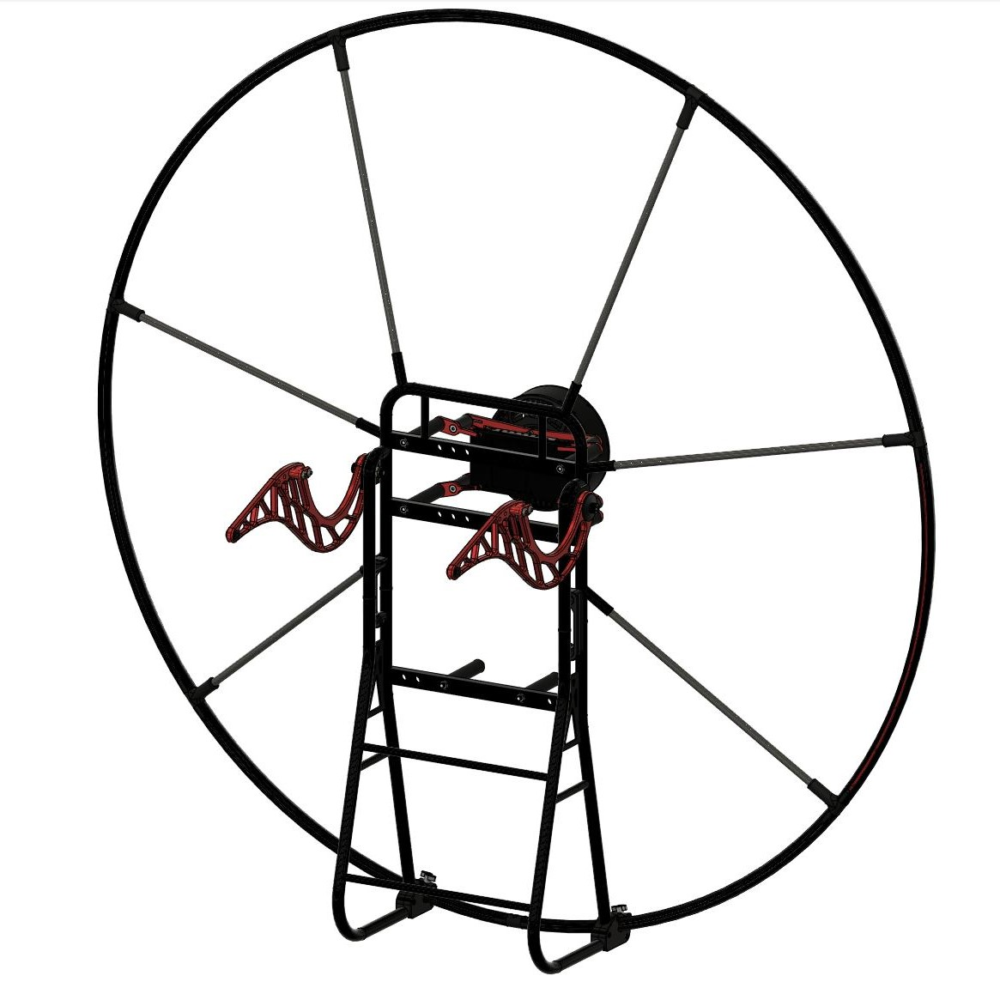
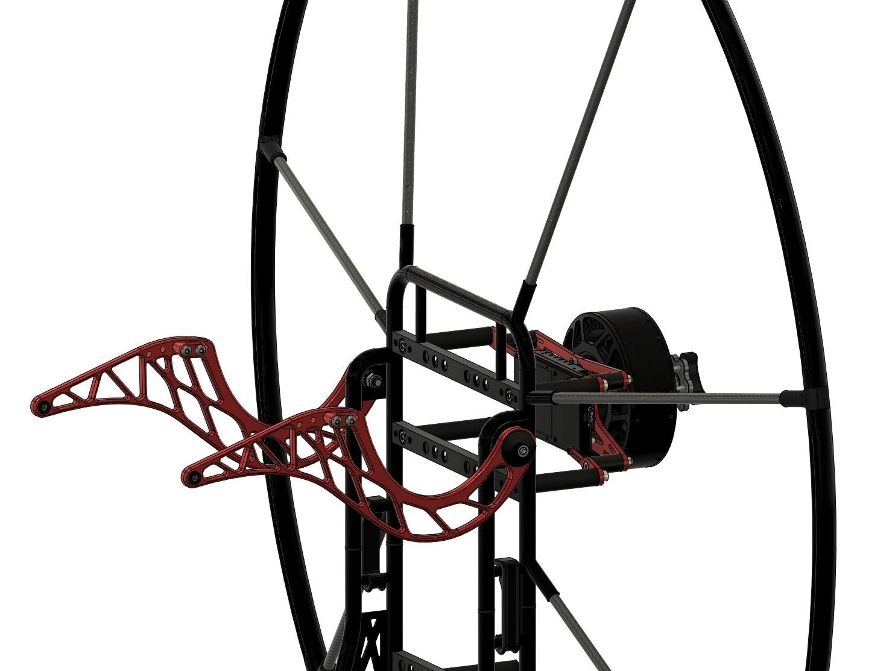
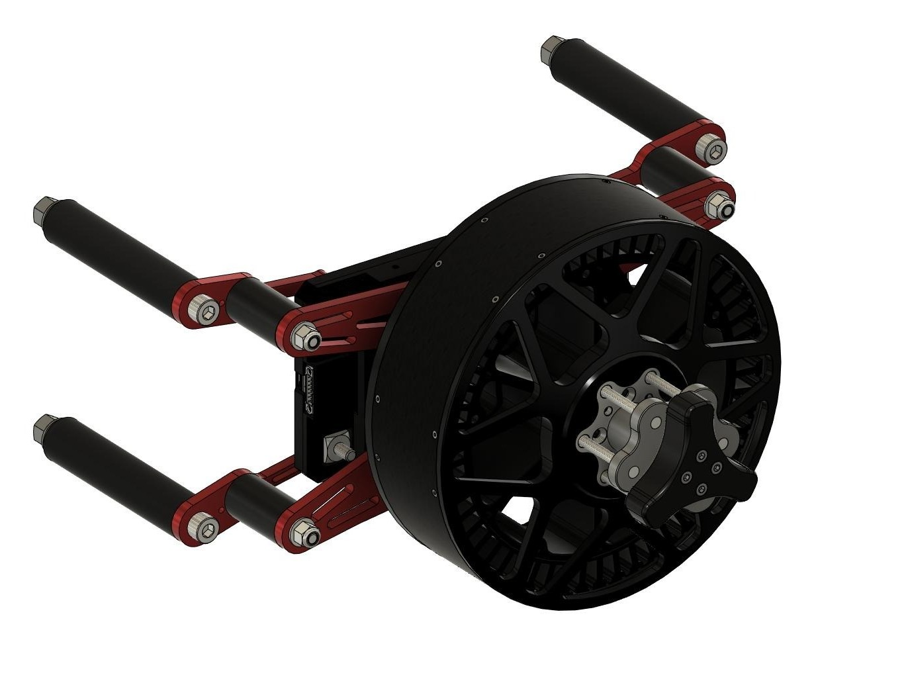

# OpenPPG SP140 3D Files

This repo contains the CAD files for the SP140 electric paramotor. You'll find models for the frame, power components, and mounting hardware.

For more info about the project and community, check out [openppg.com](https://openppg.com).

## What's Here

CAD files for:

- Complete SP140 frame assembly
- Individual frame parts (main sections, clamps, tubes, connectors)
- OpenPPG ICE (Internal Combustion Engine) Power Pack
- Electric Power Pack components (battery pack, motor, mounting hardware)

  
  
  

## Viewing STEP Files

All CAD drawings are in STEP format (ISO 10303), which works with most CAD software. Here are some options:

- **FreeCAD**: Open-source 3D CAD modeler. Works on Windows, macOS, and Linux. [Download FreeCAD](https://www.freecadweb.org/)
- **Autodesk Fusion 360**: Professional CAD software with a free tier for hobbyists and startups. [Learn more](https://www.autodesk.com/products/fusion-360/)
- **Onshape**: Cloud-based CAD that runs in your browser. [Sign up](https://www.onshape.com/)
- **SOLIDWORKS**: Industry-standard professional CAD software. [Learn more](https://www.solidworks.com/)
